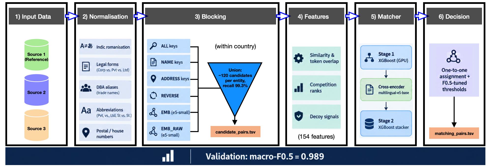
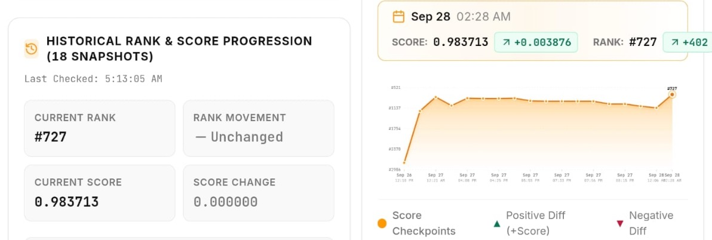

# Business Entity Resolution: Amazon ML Challenge 2026

Pipeline for matching business records across three independent sources with no shared identifier.
For every entity in the deduplicated reference source (S1), it finds all records in Source 2 and
Source 3 that describe the same business, using only noisy names, addresses and a country label.
Entities with no match are kept with an empty list.

**Holdout macro-F0.5: 0.98908** on 220,682 training S1 entities never used for training or tuning
(US 0.98872, India 0.98961). Trained on US and India; the test set adds France, which never appears
in training and is handled without any country-specific rules.

The full write-up is in [`docs/documentation.pdf`](docs/documentation.pdf).

## Pipeline



1. **Normalisation**: Indic romanisation, legal forms, DBA aliases, abbreviations, postal and house numbers.
2. **Blocking**: six retrieval passes within each country label (ALL, NAME, ADDRESS and REVERSE keys, plus
   multilingual-e5-small embeddings of the normalised and the original text). Their union gives about
   120 candidates per S1 entity with 99.3% pair recall.
3. **Features**: 154 per pair, covering similarity, token overlap, competition ranks and label-free decoy signals.
4. **Matcher**: Stage 1 XGBoost on GPU, a multilingual-e5-base cross-encoder, then a Stage 2 XGBoost stacker.
5. **Decision**: one-to-one assignment and F0.5-tuned thresholds.


Three design principles:

* **Country-agnostic.** Country is an open set of labels, used only to form blocking groups and a
  same-country feature. It is never one-hot encoded or hard-coded. IDF and decoy-word statistics are
  recomputed on each split, and monotone constraints stop the trees from memorising country quirks.
* **Explicit competition.** Features describe how a candidate ranks among the other candidates of the
  same S1 entity, and how that S1 entity ranks among the S1 entities competing for the same candidate.
* **Leakage-safe scoring.** Every probability used for a decision is held out: entity-grouped
  out-of-fold predictions, a cross-fitted cross-encoder, and a 10% entity-level holdout.

## Repository layout

```
business-entity-resolution/
├── entity_resolution/
│   ├── config.py          # every tunable setting; defaults reproduce the final run
│   ├── io_utils.py        # reading the challenge TSVs, writing outputs, running the validator
│   ├── normalize.py       # Sec. 3.2  name / address normalisation, transliteration map
│   ├── blocking.py        # Sec. 3.3  weighted blocking keys, sparse top-k retrieval passes
│   ├── emb_blocking.py    # Sec. 3.3  GPU embedding passes (EMB, EMB_RAW)
│   ├── features.py        # Sec. 3.4  global-context and per-pair features, Stage-2 features
│   ├── decoy.py           # Sec. 3.4  label-free decoy signals
│   ├── model.py           # Sec. 3.5  XGBoost boosters, grouped folds, monotone constraints
│   ├── cross_encoder.py   # Sec. 3.5  cross-fitted multilingual cross-encoder
│   ├── decide.py          # Sec. 5    one-to-one assignment, threshold / expected-F0.5 selection
│   ├── metrics.py         # macro F-beta as defined by the challenge
│   ├── progress.py        # progress bars
│   └── run.py             # end-to-end pipeline and command-line interface
├── scripts/
│   └── run_pipeline.py    # environment / GPU checks, then the full run with logging
├── docs/documentation.pdf
└── requirements.txt
```

## Installation

```bash
git clone <repo-url> business-entity-resolution && cd business-entity-resolution
python -m venv .venv && source .venv/bin/activate
pip install torch --index-url https://download.pytorch.org/whl/cu121   # a CUDA build of PyTorch
pip install -r requirements.txt   
```

Use **XGBoost 2.1.x**. XGBoost 3.x crashed at full scale on GPU (`CUDA_ERROR_INVALID_VALUE` in
`cuMemCreate`) while small tests passed. `multilingual-e5-small` and `multilingual-e5-base` (both MIT)
are downloaded from the Hugging Face Hub on first use.

## Data

The challenge data is not included. Place it as:

```
data/
├── train/
│   ├── train_source1.tsv          # entity_id, business_name, business_address, country
│   ├── train_source2.tsv
│   ├── train_source3.tsv
│   └── train_ground_truth.tsv     # source1_entity_id, matched_entity_ids (comma-separated)
└── test/
    ├── test_source1.tsv
    ├── test_source2.tsv
    └── test_source3.tsv
```

If the challenge's `validate_submission.py` is at `<data-dir>/../utils/` (or passed with `--validator`),
it is run on the outputs automatically.

## Usage

```bash
# full run with the final settings (checks the GPU, XGBoost and PyTorch first)
python scripts/run_pipeline.py --data-dir data

# quick check on 100k training entities (test set skipped)
python scripts/run_pipeline.py --data-dir data --dev 100000

# the pipeline directly, with any setting overridden
python -m entity_resolution.run --data-dir data --out-dir output --cross-encoder --seeds 42,7,2026
python -m entity_resolution.run --help
```

Every long step is checkpointed under `work/` (keyed by the settings it depends on), so an
interrupted run resumes from the last finished step. `--blocking-only` stops after the blocking
report, for fast tuning of retrieval. The launcher fixes `PYTHONHASHSEED=0`; without it, Python's
per-process string hashing changes how ties in the top-k retrieval are broken, so candidate sets can
differ slightly between runs.

### Outputs

| File | Content |
|---|---|
| `output/matching_results.tsv` | final match list for every test S1 entity (empty if none) |
| `output/candidate_pairs.tsv` | every candidate generated by blocking (every match is among them) |
| `output/matching_results_calibrated.tsv` | the same with a logit bias for countries absent from training (Sec. 6) |
| `work/artifacts/report.json` | blocking recall, OOF / holdout macro-F0.5, chosen decision rule, test summary |
| `work/artifacts/feature_importance.tsv` | Stage-1 and Stage-2 feature gains |
| `work/artifacts/oof_errors.tsv` | out-of-fold errors by type (false merge, missed, wrong, extra, partial) |
| `work/artifacts/blocking_misses.tsv` | sample of true pairs missed by blocking, with diagnostics |

## Final configuration

| Component | Setting |
|---|---|
| Blocking depths | ALL 20, NAME 10, ADDRESS 15, REVERSE 3, EMB 20, EMB_RAW 20 (per S1, per source) |
| Key pruning | keys implying more than 2M pairs are dropped |
| Stage 1 / Stage 2 | XGBoost 2.1 on GPU, depth 8, lr 0.05, subsample / colsample 0.8, 256 bins, monotone constraints |
| Training | 600,000 sampled S1 entities, 3 entity-grouped folds, early stopping, 1 seed |
| Cross-encoder | `intfloat/multilingual-e5-base`, 128 tokens, AdamW lr 2e-5, batch 128, 1 epoch, BF16, cross-fitted on 2 halves |
| Validation | 10% entity holdout (220,682 S1), never trained or tuned on |
| Decision | one-to-one assignment, S2 / S3 thresholds tuned on out-of-fold predictions |

## Results

| Measure | Value |
|---|---|
| Holdout macro-F0.5 (220,682 never-trained S1) | 0.98908 (US 0.98872, India 0.98961) |
| Out-of-fold macro-F0.5, all 2,206,821 train S1 | 0.98914 (US 0.98877, India 0.98969) |
| Blocking pair recall / oracle macro-F0.5 ceiling | 0.9933 / 0.9980 |
| Stage 1 only vs Stage 2 + cross-encoder | 0.98202 vs 0.98923 |
| Test candidate pairs | 213,023,010 (about 123 per S1) |
| Test S1 with matches / empty | 1,634,463 / 98,081 |

## Limitations

* One booster seed and three folds were used because of compute limits.
* France has no labels, so its quality can only be checked indirectly (match-rate consistency).
* The 505-token transliteration map is learned from the full training ground truth, holdout included;
  learning it from non-holdout entities only would make validation fully label-clean.
* About 0.67% of true pairs are missed by blocking; `blocking_misses.tsv` and `oof_errors.tsv` list
  concrete cases.

## Leaderboard

Final challenge leaderboard (28 September 2026): **score 0.983713, rank #727**. The last
submission improved the score by 0.003876 and the rank by 402 places.


